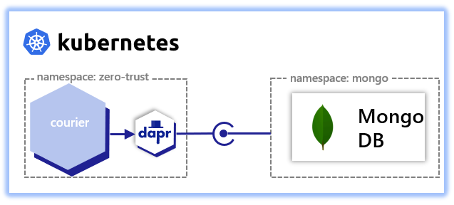

# courier

courier provides APIs for scheduling a delivery with a courier and retrieving the status of a courier.
This demonstrates:
- State management using [state management building block](https://docs.dapr.io/developing-applications/building-blocks/state-management/state-management-overview/)
- Service invocation access control
- Component scoping



## Deploy
Following are steps to deploy this service:
- [Complete cluster setup](https://github.com/jandauz/zero-trust/tree/main/setup) including deployment of mongodb
- `make image` to create and publish Docker container
  - > Note: If using a k3d-managed registry  ensure that `DOCKER_REGISTRY` is set to the correct address. Use `make k3d-registry` to determine the address of the k3d-managed registry and set using `export DOCKER_REGISTRY=<k3d-registry>` where `<k3d-registry>` is the address of the k3d-managed registry.
- `make deploy` to deploy the courier service and Dapr state management component

## Dapr state management building block
The Dapr state management building block provides a plug and play way of interacting with a variety of state management components while also providing features common with distributed applications such as:
- Distributed concurrency and data consistency
- Bulk CRUD operations

The state management components supported include but are not limited to:
- MongoDB
- Redis
- Azure CosmosDB
Visit [state stores](https://docs.dapr.io/reference/components-reference/supported-state-stores/) for a complete list of supported components.

## Service invocation access control
Dapr provides [service invocation access control](https://docs.dapr.io/operations/configuration/invoke-allowlist/) which is the ability to specify what operations callers can perform on the application.

The `ingest` service has the following access control policies:
```yaml
apiVersion: dapr.io/v1alpha1
kind: Configuration
metadata:
  name: courier-config
  namespace: zero-trust
spec:
  accessControl:
    defaultAction: deny             # default action when no policies are matched
    trustDomain: "zero-trust"       # the assigned trust domain
    policies:                       # specifies operations callers may perform
      - appId: scheduler            # Dapr AppID of the caller
        defaultAction: deny         # default action when no operations are matched
        trustDomain: "zero-trust"   # trust domain of the caller
        namespace: "zero-trust"     # namespace of the caller
        operations:                 # operations to configure
        - name: /schedule-delivery  # path of the operation
          httpVerb: ["POST"]        # HTTP verbs to configure
          action: allow             # allow or deny the operation
      - appId: traefik-ingress      
        defaultAction: deny
        trustDomain: "public"
        namespace: "traefik"
        operations:
        - name: /find-courier
          httpVerb: ["GET"]
          action: allow
```
With the above configuration, the `courier` service will only accept calls from the `scheduler` and `traefik-ingress` service and only the `POST /schedule-delivery` and `GET /find-courier` operations respectively.. All other operations and callers are denied.

## Component scoping
Dapr provides two ways of [scoping access to components](https://docs.dapr.io/operations/components/component-scopes/) - namespaces and `scopes` in the component spec.

### Namespaces
Kubernetes namespaces provides logical separation of applications but that does not prevent communication between applications in different namespaces. Dapr components, on the other hand, can only access components deployed to the same namespace. In order to access the Dapr API of a component in a different namespace the component needs to be fully qualified. For example. `service-a` in `namespace-a` invoking the `execute` operation on `service-b` in `namespace-b` would send the following request:
```shell
$ https://localhost:3500/v1.0/invoke/service-b.namespace-b/method/execute
```

### Component spec
Another way to scope component access is to specify the `scopes` in the component manifest. The `courier-store` state management building block has the following manifest:
```yaml
apiVersion: dapr.io/v1alpha1
kind: Component
metadata:
  name: courier-store
  namespace: zero-trust
spec:
  type: state.mongodb
  version: v1
  metadata:
  - name: host
    value: mongo-mongodb-headless.mongo.svc:27017
  - name: username
    value: dapr
  - name: password
    secretKeyRef:
      name: mongo-mongodb
      key: mongodb-password
  - name: databaseName
    value: dapr
  - name: collectionName
    value: courier
scopes:
- courier
```
The above configuration limits access only to the `courier` service.