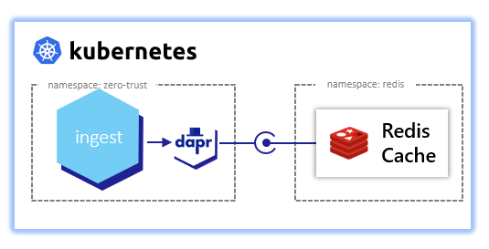

# ingest

ingest receives a `schedule-delivery-request`, generates a UUID, and queues it for processing. This demonstrates:
- Publishing using Dapr [pub/sub building block](https://docs.dapr.io/developing-applications/building-blocks/pubsub/pubsub-overview/)
- Service invocation access control
- Component scoping
- Topic scoping
- Secret scoping



## Deploy
Following are steps to deploy this service:
- [Complete cluster setup](https://github.com/jandauz/zero-trust/tree/main/setup) including deployment of redis
- `make image` to create and publish Docker container
  - > Note: If using a k3d-managed registry  ensure that `DOCKER_REGISTRY` is set to the correct address. Use `make k3d-registry` to determine the address of the k3d-managed registry and set using `export DOCKER_REGISTRY=<k3d-registry>` where `<k3d-registry>` is the address of the k3d-managed registry.
- `make deploy` to deploy the ingest service and Dapr pub-sub component

## Dapr pub/sub building block
The Dapr pub/sub building block provides a plug and play way of interacting with a variety of pub/sub components including but not limited to:
- Redis Streams
- AWS SNS/SQS
- GCP Pub/Sub
- Azure Events Hub
Visit [pub/sub brokers](https://docs.dapr.io/reference/components-reference/supported-pubsub/) for a complete list of supported components.

## Service invocation access control
Dapr provides [service invocation access control](https://docs.dapr.io/operations/configuration/invoke-allowlist/) which is the ability to specify what operations callers can perform on the application.

The `ingest` service has the following access control policies:
```yaml
apiVersion: dapr.io/v1alpha1
kind: Configuration
metadata:
  name: ingest-config
  namespace: zero-trust
spec:
  accessControl:
    defaultAction: deny             # default action when no policies are matched
    trustDomain: "zero-trust"       # the assigned trust domain
    policies:                       # species operations callers may perform
    - appId: traefik-ingress        # Dapr AppID of the caller
      defaultAction: deny           # default action when no operations are matched
      trustDomain: "public"         # trust domain of the caller
      namespace: "traefik"          # namespace of the caller
      operations:                   # operations to configure
      - name: /delivery-requests    # path of the operation
        httpVerb: ["POST"]          # HTTP verbs to configure
        action: allow               # allow or deny the operation
```
With the above configuration, the `ingest` service will only accept `POST /delivery-requests` from the `traefik-ingress` service in the `traefik` namespace. All other operations and callers are denied.

## Component scoping
Dapr provides two ways of [scoping access to components](https://docs.dapr.io/operations/components/component-scopes/) - namespaces and `scopes` in the component spec.

### Namespaces
Kubernetes namespaces provides logical separation of applications but that does not prevent communication between applications in different namespaces. Dapr components, on the other hand, can only access components deployed to the same namespace. In order to access the Dapr API of a component in a different namespace the component needs to be fully qualified. For example. `service-a` in `namespace-a` invoking the `execute` operation on `service-b` in `namespace-b` would send the following request:
```shell
$ https://localhost:3500/v1.0/invoke/service-b.namespace-b/method/execute
```

### Component spec
Another way to scope component access is to specify the `scopes` in the component manifest. The `redis` pub/sub building block as the following manifest:
```yaml
apiVersion: dapr.io/v1alpha1
kind: Component
metadata:
  name: pubsub
  namespace: zero-trust
spec:
  type: pubsub.redis
  version: v1
  metadata:
  - name: redisHost
    value: redis-master.redis.svc:6379
  - name: redisPassword
    secretKeyRef:
      name: redis
      key: redis-password
  - name: publishingScopes
    value: "ingest=delivery-requests"
scopes:
- ingest
auth:
  secretStore: kubernetes
```
The above configuration limits access only to the `ingest` service.

## Topic scoping
Pub/sub building blocks have a feature called [topic scoping](https://docs.dapr.io/developing-applications/building-blocks/pubsub/pubsub-scopes/) which limits the following:
- Which topics can be used (published or subscribed)
- Which applications are allowed to publish to specific topics
- Which applications are allowed to subscribe to specific topics

Refering back to the `redis` pub/sub building block, the component scopes publishing for the `ingest` service to only the `delivery-requests` topic.

## Secret scoping
Dapr provides the ability to [scope application access to secret stores](https://docs.dapr.io/operations/configuration/secret-scope/) as well as specific secrets. The `ingest` service has the secret store scope:
```yaml
apiVersion: dapr.io/v1alpha1
kind: Configuration
metadata:
  name: ingest-config
  namespace: zero-trust
spec:
  secrets:                      # secrets to scope
    scopes:                     # scope configurations
    - storeName: kubernetes     # name of the secret store
      defaultAccess: deny       # allow or deny access
```
With the above configuration, the `ingest` service is denied access to the kubernetes secret store.

With the following configuration, the `ingest` service would only be granted access to the `redis-password` secret.
```yaml
apiVersion: dapr.io/v1alpha1
kind: Configuration
metadata:
  name: ingest-config
  namespace: zero-trust
spec:
  secrets:                      # secrets to scope
    scopes:                     # scope configurations
    - storeName: kubernetes     # name of the secret store
      defaultAccess: deny       # allow or deny access
      allowedSecrets: ["redis-password"]
```