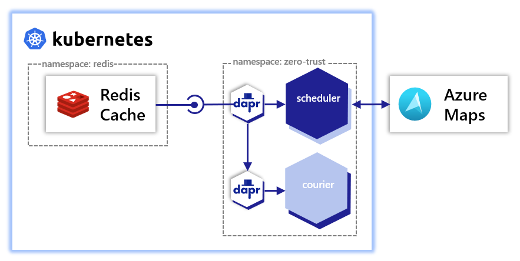

# scheduler

scheduler subscribes to a `delivery-requests` topic, sends a request to [Azure Maps](https://azure.microsoft.com/en-us/services/azure-maps/) to determine a route for the delivery, and schedules the delivery with a courier.
This demonstrates:
- Subscribing using Dapr [pub/sub building block](https://docs.dapr.io/developing-applications/building-blocks/pubsub/pubsub-overview/)
- Component scoping
- Topic scoping
- Secret scoping



## Deploy
Following are steps to deploy this service:
- [Make an Azure Maps account](https://docs.microsoft.com/en-us/azure/azure-maps/quick-demo-map-app#create-an-azure-maps-account)
- [Obtain primary key](https://docs.microsoft.com/en-us/azure/azure-maps/quick-demo-map-app#get-the-primary-key-for-your-account) and store as `AZURE_MAPS_SUBSCRIPTION_KEY` environment variable
- [Complete cluster setup](https://github.com/jandauz/zero-trust/tree/main/setup) including deployment of redis
- `make image` to create and publish Docker container
  - > Note: If using a k3d-managed registry  ensure that `DOCKER_REGISTRY` is set to the correct address. Use `make k3d-registry` to determine the address of the k3d-managed registry and set using `export DOCKER_REGISTRY=<k3d-registry>` where `<k3d-registry>` is the address of the k3d-managed registry.
- `make deploy` to deploy the scheduler service, Dapr pub-sub component, and azure maps k8s secret

## Dapr pub/sub building block
The Dapr pub/sub building block provides a plug and play way of interacting with a variety of pub/sub components including but not limited to:
- Redis Streams
- AWS SNS/SQS
- GCP Pub/Sub
- Azure Events Hub
Visit [pub/sub brokers](https://docs.dapr.io/reference/components-reference/supported-pubsub/) for a complete list of supported components.

## Component scoping
Dapr provides two ways of [scoping access to components](https://docs.dapr.io/operations/components/component-scopes/) - namespaces and `scopes` in the component spec.

### Namespaces
Kubernetes namespaces provides logical separation of applications but that does not prevent communication between applications in different namespaces. Dapr components, on the other hand, can only access components deployed to the same namespace. In order to access the Dapr API of a component in a different namespace the component needs to be fully qualified. For example. `service-a` in `namespace-a` invoking the `execute` operation on `service-b` in `namespace-b` would send the following request:
```shell
$ https://localhost:3500/v1.0/invoke/service-b.namespace-b/method/execute
```

> Note: The scheduler service does not implement the Service Invocation build block and therefore cannot be directly interacted with. However, it does call out to the `courier` service and must quality the service correctly e.g. https://localhost:3500/v1.0/invoke/courier.zero-trust/method/schedule-delivery.

### Component spec
Another way to scope component access is to specify the `scopes` in the component manifest. The `redis` pub/sub building block has the following manifest:
```yaml
apiVersion: dapr.io/v1alpha1
kind: Component
metadata:
  name: pubsub
  namespace: zero-trust
spec:
  type: pubsub.redis
  version: v1
  metadata:
  - name: redisHost
    value: redis-master.redis.svc:6379
  - name: redisPassword
    secretKeyRef:
      name: redis
      key: redis-password
  - name: subscriptionScopes
    value: "scheduler=delivery-requests"
scopes:
- scheduler
auth:
  secretStore: kubernetes
```
The above configuration limits access only to the `scheduler` service.

## Topic scoping
Pub/sub building blocks have a feature called [topic scoping](https://docs.dapr.io/developing-applications/building-blocks/pubsub/pubsub-scopes/) which limits the following:
- Which topics can be used (published or subscribed)
- Which applications are allowed to publish to specific topics
- Which applications are allowed to subscribe to specific topics

Refering back to the `redis` pub/sub building block, the component scopes subscription for the `scheduler` service to only the `delivery-requests` topic.

## Secret scoping
Dapr provides the ability to [scope application access to secret stores](https://docs.dapr.io/operations/configuration/secret-scope/) as well as specific secrets. The `scheduler` service has the secret store scope:
```yaml
apiVersion: dapr.io/v1alpha1
kind: Configuration
metadata:
  name: ingest-config
  namespace: zero-trust
spec:
  secrets:                              # secrets to scope
    scopes:                             # scope configurations
    - storeName: kubernetes             # name of the secret store
      defaultAccess: deny               # allow or deny access
      allowedSecrets: ["azure-maps"]    # allow access to only the azure-maps secret
```
With the above configuration, the `scheduler` service is allowed access only to the `azure-maps` secret in the kubernetes store.