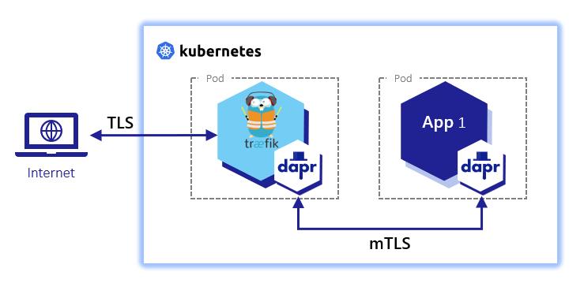

# "Daprized" Traefik

This document builds on the work by [Carlos Mendible](https://carlos.mendible.com/2020/04/05/kubernetes-nginx-ingress-controller-with-dapr/) and [Mark Chmarny](https://github.com/mchmarny/dapr-demos/tree/master/daprized-ingress) for a "daprized" ingress controller using Traefik.



> Note: Reason for using Traefik as opposed to NGINX are:
> - k3d comes with Traefik (although the steps outlined here install k3d > without traefik because of the need to inject Dapr sidecar)
> - Challenging myself to daprize a non-documented ingress controller

## Deploy Traefik with Dapr

[Dapr.io annotations](https://docs.dapr.io/operations/hosting/kubernetes/kubernetes-annotations/) needs to be added to a pod in order for the Dapr sidecar injector to inject a Dapr sidecar into the Traefik pod.

To do that, create a file that contains the annotations:
```yaml
# ingress-annotations.yaml

deployment:
  podAnnotations:
    dapr.io/enabled: "true"
    dapr.io/app-id: "traefik-ingress"
    dapr.io/app-protocol: "http"
    dapr.io/app-port: "8000"
    dapr.io/log-as-json: "true"
```

Then deploy Traefik using Helm and provide the `ingress-annotations.yaml` file.
```shell
helm repo add traefik https://helm.traefik.io/traefik
helm install traefik -f ingress-annotations.yaml
```

## Create an Ingress
A k8s ingress needs to be created to provide external access to the cluster.
> Note: I'll be using Traefik's [IngressRoute](https://doc.traefik.io/traefik/routing/providers/kubernetes-crd/) for reasons similar to above.

Since we want to only use TLS we need to create a k8s secret that contains the TLS certificate and key. The certificate and key would typically be provided by a Certificate Authority like Verisign or LetsEncrypt. However, we can use something like [mkcert](https://github.com/FiloSottile/mkcert) for development purposes.

To generate a development certifcate using mkcert first create a local CA:
```shell
$ mkcert -install
```
Then generate certificates for the desired domains:
```shell
$ mkcert example.com "*.example.com" example.test localhost 127.0.0.1 ::1
```
> Note: In this case I'm using example.com. It can be any domain that is publicly addressable. For local development, you can modify the OS's hosts file. e.g. `/etc/hosts` on Linux or `C:/Windows/system32/drivers/etc/hosts` on Windows.

The output of the above command should be:
```shell
Created a new certificate valid for the following names 📜
 - "example.com"
 - "*.example.com"
 - "example.test"
 - "localhost"
 - "127.0.0.1"
 - "::1"

The certificate is at "./example.com+5.pem" and the key at "./example.com+5-key.pem" ✅
```
The `+5` indicates five Subject Alternate Names for the example.com domain.

Now, we can create the k8s secret:
```shell
$ kubectl create secret tls tls-secret --key example.com+5-key.pem --secret example.com+5.pem
```

Then, create the IngressRoute:
```yaml
# ingress.yaml

apiVersion: traefik.containo.us/v1alpha1
kind: IngressRoute
metadata:
  name: ingress

spec:
  entryPoints:
  - websecure

  routes:
  - match: Host(`example.com`) && PathPrefix(`/v1`)
    kind: Rule
    services:
    - name: traefik-ingress-dapr
      port: 80

  tls:
    secretName: tls-secret
    domains:
    - main: example.com
      sans:
      - '*.example.com'
      - example.test
      - localhost
      - '127.0.0.1"
      - '::1'
```

Lastly, deploy the IngressRoute:
```shell
$ kubectl apply -f ingress.yaml
```

## Test the "Daprized" Traefik ingress
To test that the ingress has been "daprized" we can send a request to the `/healthz` endpoint of the Traefik Dapr sidecar.

> Note: As mentioned in previous section, the domain must be publicly addressable. For local development, you can modify the OS's hosts file and include an entry that binds the domain specified to `127.0.0.1`. e.g.
>
> 127.0.0.1 example.com

Send a curl request to the Dapr sidecar:
```shell
curl -v -H "Content-Type: application/json" https://example.com/v1.0/healthz"
```
The output should include:
```shell
GET /v1.0/healthz HTTP/2
HTTP/2 204
```